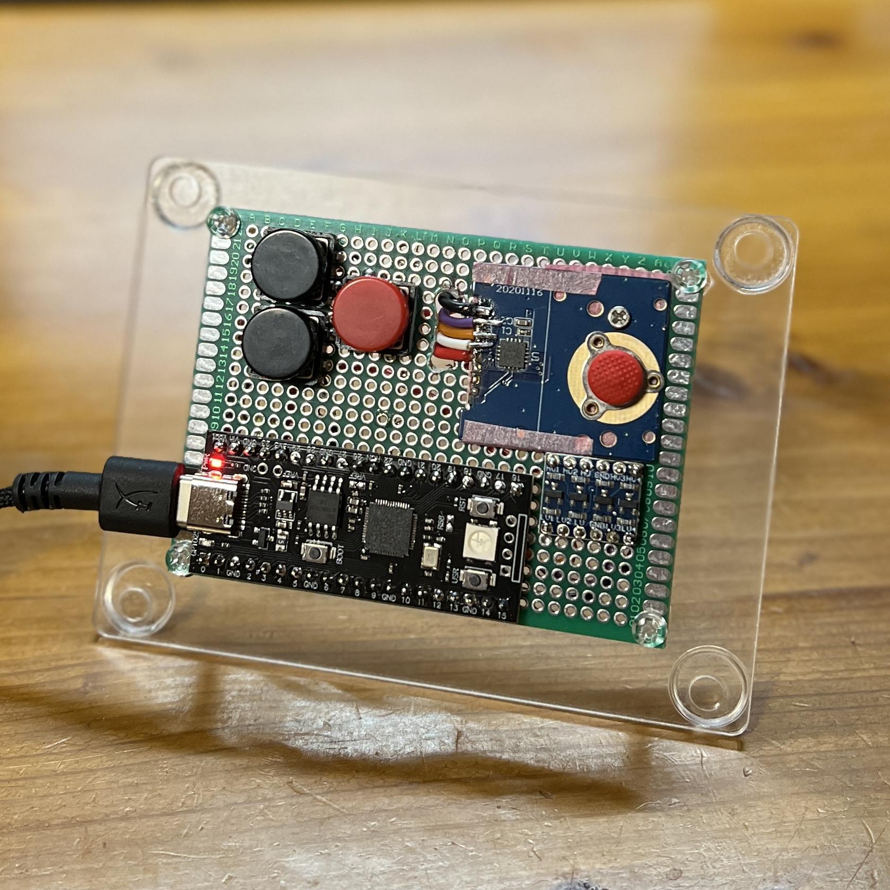

# RedPoint

TrackPoint系ポインティングモジュールを、独立したUSB HIDデバイスとして使うための
ハードウェア／ファームウェア／Configuratorの試作プロジェクトです。



## Overview

市販機器から入手したTrackPoint系モジュールを解析し、
Raspberry Pi Pico（RP2040）で入力を読み取り、
USB HID MouseとしてPCから利用できるところまで実装しています。

現在の試作機では、

- ポインティング操作
- 独立した Left / Middle / Right ボタン
- ポインタ感度・加速度・反転設定
- Middle押下中の感度切替
- 各ボタンへのMouse / Keyboard Shortcut / Disabled割当
- Web SerialによるブラウザConfigurator
- 設定のFlash保存
- WS2812による状態表示

が動作します。

## Project status

**Working prototype / under development**

USB HIDとしての基本機能とWeb Serial Configuratorは実機動作済みです。
USB Ethernet経由でのConfigurator利用は現在実験中です。

## Hardware

- TrackPoint系 PS/2 module
- Raspberry Pi Pico / RP2040
- 3 × physical buttons
- Level conversion circuitry

## Configurator

[Open Configurator](https://izaqsee.github.io/red_dot_pointing/)

Chrome / EdgeなどWeb Serial対応ブラウザから、
ファームウェア設定を変更できます。

---

## Firmwareのbuild / upload

実機確認済みの環境:

- Arduino RP2040 (Philhower) core **6.1.0**
- FQBN: `rp2040:rp2040:vccgnd_yd_rp2040`
- Windows / Arduino CLI **1.5.2-rc.1**

Arduino CLIをPATHに追加し、上記coreをインストール済みの環境で、repo直下から実行します。
Arduino IDE同梱のCLIを使う場合は、`arduino-cli`をその実行ファイルのパスに置き換えます。

```powershell
arduino-cli compile --fqbn rp2040:rp2040:vccgnd_yd_rp2040 firmware/redpoint
powershell.exe -NoProfile -ExecutionPolicy Bypass -File .\tools\upload-redpoint.ps1
```

VS Codeでは既存の`.vscode/tasks.json`から次のタスクを実行できます。

- **RedPoint: Build**（既定のbuild task）
- **RedPoint: Build & Upload**（RedPoint自動検出 → build → upload）

既存の**Ctrl+Alt+U**は同じ`RedPoint: Build & Upload`を呼び出します。
COM番号が変更されても、tasks.jsonの手動編集は不要です。Buildは従来どおりcompileのみです。
helperはWindows標準のCIMでUSB serial portを列挙し、`PNPDeviceID`の`VID_2E8A`で候補を絞ります。
PIDを固定せず、候補が1台でも全候補へ115200 baudでGETを送り、
`@CONFIG` JSONの`ok: true`かつ`command: "GET"`を確認します。
応答待ちは各候補1,200 ms。debug行／不正JSONを無視し、分割受信・CR／LFに対応します。
probe後はportをclose／disposeし、認定が1台だけならそのCOMを既存の
`arduino-cli compile --upload --port ...`へ渡します。bootloaderへの遷移はArduino CLIに任せます。
認定0台・複数台では候補と結果を表示して中止し、推測でportを選びません。

uploadせず検出だけを確認する場合（GETのみ送信、設定変更なし）:

```powershell
powershell.exe -NoProfile -ExecutionPolicy Bypass -File .\tools\upload-redpoint.ps1 -DetectOnly
# 別の作業ディレクトリから。空白を含むパスも指定可能:
powershell.exe -NoProfile -ExecutionPolicy Bypass -File "C:\work\RedPoint project\tools\upload-redpoint.ps1" -WorkspacePath "C:\work\RedPoint project" -DetectOnly
```

`RedPoint detected on COMxx`が出れば検出成功です。実際にbuild／uploadするときは`-DetectOnly`を外します。
CLIの終了コードはそのままtaskへ伝わり、検出失敗は終了コード1になります。
追加のPowerShell moduleは不要です。Windows PowerShell 5.1／PowerShell 7に対応します。

**実機確認:** ConfiguratorをDisconnectしSerial Monitorを閉じ、`-DetectOnly`で検出を確認します。
USBの挿し直しでCOM番号が変わっても再検出されること、未接続時とRedPoint複数接続時は中止することを確認してください。
uploadが必要なときにCtrl+Alt+Uを実行し、検出したCOMがCLIに渡ることを確認します。

**制限:** 正常起動してGETに応答するfirmwareが必要です。bootloader状態、他アプリによるport占有、
VIDが異なるfirmwareは検出できません。待ち時間は候補数に比例し、OSのport open／close時間は別途かかります。
GETと同じ応答を実装した別firmwareは区別できません。probeが失敗した候補のidentityも確定できません。
検出後からbuild／upload完了までUSBを抜き差ししないでください（COM再割当の競合は防げません）。
GET probeはLEDのConfigurator active判定を一時的に更新しますが、RAM設定やFlashは変更しません。

実機を使わないhelperテスト:

```powershell
powershell.exe -NoProfile -ExecutionPolicy Bypass -File .\tests\upload-redpoint.test.ps1
```

Serial／CIMはmock、CLIは一時的なfixtureに置き換えます。実機probe・実機uploadは実行しません。

Arduino IDEでは`firmware/redpoint/redpoint.ino`を開きます。
同じフォルダの`config*`（設定・レコード・保存）、`button_action.*`（Actionと所有数）、
`keyboard_mapping.*`（HID usageからcore APIへの変換）も必要です。
upload前にConfiguratorのDisconnectを押し、Serial Monitorなども閉じてください。
ファームウェアはcore標準のMouse / Keyboardライブラリを使用します。USB Stackは既存のPico SDKを維持してください。
Keyboard追加後はUSBが再列挙され、COM番号が変わる場合があります。

## Configuratorを起動する

`configurator/`のVanilla HTML / CSS / JavaScriptだけで動作します。
framework、npm install、build、backend処理、外部API、CDNは不要です。
起動時にsame-originの`api/command`へGET commandをPOSTし、有効なRedPoint応答があれば
**USB Ethernet HTTP mode**へ自動接続します。APIがなければ既存の**Web Serial API**へfallbackします。
HTTP modeはpermission dialogやsecure contextを必要とせず、iPadのようにWeb Serialがない環境でも使用できます。
HTTP modeのDisconnectはlogical session切断で、ConnectでGET同期から再接続します。
FrontendにデバイスIPは固定していません。

HTTP server側のlwIP adapterとstatic asset生成は追加済みですが、現在のArduino sketch単独ではEthernetを有効化しません。
実機確認済みのTinyUSB network実験とHID／Flash／LEDを1つのbuildへ統合する作業は残っています。
構成・CMake組込・実機確認手順は[USB Ethernet integration](docs/usb-ethernet.md)を参照してください。

repo直下で、Pythonによるローカルの静的ファイル配信を起動します。

```powershell
python -m http.server 8000 --bind 127.0.0.1 --directory configurator
```

Web Serial対応のChromium系ブラウザ（デスクトップ版ChromeまたはEdge）で[http://localhost:8000](http://localhost:8000)を開きます。
Web Serialはsecure context（localhostまたはHTTPS）で使用します。
ブラウザの対応状況とsecure contextを画面で検出し、利用できない場合は理由を表示します。
このHTTPサーバは静的ファイルの配信だけを行い、デバイスの設定値やSerial dataは受け取りません。
終了はターミナルでCtrl+Cです。

1. USBでRedPointを接続し、Serial Monitorなど他のポート利用アプリを閉じる。
2. 初回は**Connect**を押し、ブラウザのポート選択画面でRedPointを選ぶ。このユーザー操作でUSB deviceへのpermissionを付与する。
3. GETの応答後、**Connected**となり、設定controlが有効になる。
4. sliderで感度、checkboxで反転を変更する。操作値と「デバイス確認値」は別表示。
5. 永続化するには**Save**を押す。未送信SETの反映後、SAVEの成功応答で**Saved**になる。
6. **Reset to defaults**はRAMのみdefaultへ戻す。defaultも保存する場合は続けて**Save**を押す。
7. 終了時は**Disconnect**を押す。

### 許可済みRedPointへの自動接続

2回目以降はpage load時に`navigator.serial.getPorts()`で、このoriginへ許可済みのportだけを取得します。
`getInfo().usbVendorId === 0x2E8A`で候補を絞り（PIDは固定しない）、GETの正常応答とconfigの型・範囲を検証します。
許可取得の`requestPort()`はConnectクリック時だけで、page load時にはpickerを開きません。
ブラウザのpermissionを削除した場合や別originでは、再度Connectから許可が必要です。
localhostとGitHub Pagesの許可は別です。
[Web Serialの公式説明](https://developer.chrome.com/docs/capabilities/serial)も参照してください。

- 1候補: open → GET同期・本人確認 → 接続を維持。不要なclose／再openはしません。
- 複数候補: 1台ずつopen → GET → close。RedPointが1台ならそのportを再openしてGET同期します。
  0台ならDisconnected、2台以上なら自動選択せずConnectでの手動選択を案内します。
- 初回GETのtimeoutは通常接続／1候補で2秒、複数候補のprobeで各1.2秒です。
  初回検証失敗ではportを閉じ、Connectから再試行できます。探索中はConnectを無効化します。
- GET成功後にのみ既存のPING capability probeとheartbeatを開始します。
  旧firmwareのUNKNOWN_COMMANDではheartbeatだけを無効化し、設定機能は継続します。
- USBのconnect eventでも、sessionがなく接続・探索・切断中でなければ許可済みportを再検出します。
  **手動Disconnect後は同じpage session内で自動再接続しません**。手動Connectは使用でき、reload後は再び自動検出します。

手動pickerはVID情報がないportも選べるよう従来どおり表示しますが、GETによる本人確認は必須です。
探索失敗はページ全体のfatal errorにはしません。probe後のclose失敗時は次候補を開かず中止します。
reader／writer lockを解放してからcloseし、再接続できない場合はUSBを挿し直してください。
Serial探索はGETだけを使用します。起動時のHTTP probeはsame-originだけで、外部backend／CDN／device情報の永続化は追加しません。

制限: GET protocolが同一の別firmwareは識別できません。ブラウザ・OSによるport open／close時間はGET timeoutに含まれません。
起動途中やport占有中は検出に失敗することがあります。切断処理中のUSB connect eventは処理を重ねず無視するため、
素早い抜き差しで復帰しなければConnectを使ってください。

GitHub Pagesでの実機確認（変更の公開後）:

1. HTTPSのPages URLを開き、初回はpickerが自動表示されず、Connectで許可・接続できることを確認。
2. reloadし、pickerなしでConnectedとなり、GETの設定値と通常のSET／RESET／SAVE／shortcutが使えることを確認。
3. 手動Disconnect後は抜き差ししても再接続せず、Connectまたはreloadで接続できることを確認。
4. 手動Disconnectしていない状態でUSBを抜き差しし、自動復帰とheartbeat再開を確認。
5. 許可済みRedPointを2台接続し、自動選択されず、Connectで選べることを確認。
6. permission削除後はConnectが再び必要なこと、Serial Monitor使用中は失敗後も手動再試行できることを確認。

感度の範囲は0～10、sliderの刻みは0.01です。0はそのモードのpointer移動を停止します。
Middle sensitivityは通常感度と乗算せず、logical Mouse Middle押下中に直接選択される倍率です。
defaultは通常1.00、Middle 0.40、反転なしです。

## ボタン割当とShortcut Recorder

Buttonsの各物理ボタンでLeft / Middle / Right ClickまたはDisabledを選択できます。
Keyboardは**Record Shortcut**を押し、実際のキーを入力します。modifierの押下状態を表示し、
最初のnon-modifier keyで記録を完了してSETします。操作値とデバイス確認値は分けて表示し、
デバイス応答後に確定します。永続化には明示的なSaveが必要です。

- Ctrl / Shift / Alt / Metaと1キー、または修飾なし1キーに対応します。例: A、Escape、F5、Ctrl+Shift+T、Alt+Left。
- EscapeとBackspaceも割当可能です。取消は**Cancel**、解除は**Disabled**を使います。
- 記録中だけkeydown/keyupを捕捉し、repeatを無視します。通常時のページのキー操作は横取りしません。
- 未対応キーは既存割当を保持してエラー表示します。Cancel、フォーカス喪失、ページ非表示、切断で記録を終了します。
- `KeyboardEvent.code`からHID usageへ変換します。英数字、標準記号、F1～F24、navigation/arrows、numpad、IntlBackslash、ContextMenu等に対応します。対応表は[shortcuts.js](configurator/shortcuts.js)にあります。
- キー位置を保存するため、実際の文字はOS側のkeyboard layoutに依存します。記号の表示名はUS配列基準です。左右modifierは区別しません。
- JIS固有キー、IME入力、AltGraph、media/Fn、modifierだけの割当は未対応です。Alt+Tab、Win+L、Ctrl+Alt+DeleteなどOS/browserが先に処理するキーは記録できない場合があります。

押下時のActionを保持してreleaseするため、押下中に設定を変えても旧Actionを正しく解放します。
同じMouse/key/modifierを複数ボタンが共有した場合は最後のreleaseまで保持します。
異なるショートカットを同時に押すとmodifierは合成されます。長押しのkey repeatはOSに従います。
Middle感度は物理ボタン位置ではなく、現在heldのMouse Middle Actionに従います。
旧4項目firmwareではPointer設定を使えますが、Buttonsはfirmware更新案内とともに無効になります。

## Runtime設定とFlash保存

- **SET**: 実機の動作へ即時反映するRAM設定。Flashを書き換えない。
- **SAVE**: 現在の設定をFlashへ明示保存し、再起動後も読み込む。
- **RESET**: RAMのみdefaultに戻す。SAVEしなければ再起動後は以前の保存値に戻る。
- **RESET → SAVE**: defaultをFlashへ保存する。
- **未保存・不正な保存データ**: 起動時に全設定をdefaultへfallbackする。

共通codecは44-byte v3でPointer/Wheel独立設定とボタン割当、CRC32を保存します。
Pico SDK版は既存sector `0x10FFF000–0x10FFFFFF`、Arduino版はEEPROM emulationを使用します。
v1/v2をRAM上で移行し、次の明示Saveでv3へ更新します。不正recordは全defaultへ戻ります。
詳細は[通信仕様](docs/protocol.md#flash保存形式と起動)と[Pico C.2報告](firmware/redpoint_pico/MILESTONE_C2.md)を参照してください。
SET、RESET、起動時はFlashを書かず、SAVE時も前回保存内容と同一ならerase/writeを省略します。

Save成功はデバイスでのcommitとFlash再読込照合が完了した後に通知されます。
UIは応答で確認した値を**Saved**とし、設定を変えると**Unsaved changes**にします。
同じ接続中に保存確認済みの値へ戻した場合もSavedになります。
再接続時のGETはRAMだけを取得するので**保存状態未確認**と表示し、Flash保存済みとは推測しません。
設定値をlocalStorageへ保存しません。SAVEの失敗・timeoutはSaved扱いにせず再試行できます。
旧firmwareではSAVEがNOT_IMPLEMENTEDになります。永続化には更新後のfirmwareが必要です。

保存中はFlash操作のため割り込みとHID/PS/2処理が短時間停止します。
デバイスを静止させてSaveし、完了までUSBを抜かないでください。
書込み後は途中frame/FIFOを破棄してpacket gapで同期を取り直します。
単一sectorなので、保存途中の電源断で以前の保存内容が失われる可能性があります。
不正なデータは次回起動時にdefaultへfallbackします。二重化・wear levelingは未実装です。
EEPROM領域やFlash容量の変更、全消去を伴う書き込みでは保存値が失われる場合があります。

設定値・Serial dataの外部送信、analytics、localStorageへの保存は行いません。
すべて同梱のローカルassetを使い、CSPはsame-originへのHTTP API通信だけを許可します。外部へのデバイスデータ送信は行いません。
GitHub Pages版でもデバイスデータは外部serverへ送りません。GitHubには静的ページの通常の取得だけが発生します。
既存のPages workflowをそのまま利用します。この変更ではpush／deployやGitHub側の設定変更は行いません。

## 通信とエラー時の動作

通信仕様のsource of truthは[docs/protocol.md](docs/protocol.md)です。
GET / SET / RESET / SAVEの形式を維持し、configへleftAction / middleAction / rightActionを追加しています。

- 115200 baud / 8N1 / flow controlなし。`@CONFIG`と`@DEBUG`を分類する。
- 分割された受信chunkを行へ復元する。debug・未知行・不正JSONは設定へ混ぜず無視する。
- `@CONFIG`の型・範囲を検証し、現在の要求に対応する応答だけを確定値にする。
- 120msのdebounceと項目ごとの最新値への集約を行い、要求は必ず1つずつ送る。
- RESETは未送信変更を破棄し、送信中SETの応答を待ってから実行する。
- SAVEは未送信SETをすべて反映してから送る。SET失敗時は保留SAVEも中止し、保存を誤認させない。
- 接続済みsessionの2秒のtimeout時は、適用済みか不明なので未送信変更を破棄し、改行＋GETで再同期する。
  遅れて届くSET/RESET/SAVE応答やエラーは再同期GETの応答に使わない。
  GETだけでは保存成功を判定できないため保存状態は未確認とし、必要ならSaveを再実行する。
  再同期にも失敗した場合は切断し、再接続を案内する。
- 切断時は保留要求を中止し、stream lockを解放してポートを閉じる。
  USB抜去・read/writeエラー後もConnectからやり直せる。

`app.js`内のprotocol処理、Serial transport、UIは関数単位で分離しています。
WebHID移行時はtransportを差し替える設計ですが、HID reportの設計・firmware対応は今後必要です。
Web SerialのAPI利用は[Chrome公式資料](https://developer.chrome.com/docs/capabilities/serial)を参照しています。

## GitHub Pages deployment

[.github/workflows/pages.yml](.github/workflows/pages.yml)はGitHub公式の
configure-pages / upload-pages-artifact / deploy-pagesを使い、**configurator/だけ**を公開します。
CSS / JSはrelative pathなので、`https://<user>.github.io/<repository>/`のproject Pagesにも対応します。
PagesのHTTPSはWeb Serialのsecure context要件を満たします。backendやbuild toolは不要です。

人間がGitHub側で行う操作:

1. GitHub repositoryを用意し、任意のremoteを設定して変更をpushする（この作業ではpushしていません）。
2. repositoryの**Settings → Pages → Build and deployment → Source**で**GitHub Actions**を選ぶ。
3. **Settings → Actions → General**でActionsと使用するGitHub公式Actionsが許可されていることを確認する。
   組織のpolicyでPages / OIDCが制限されている場合は管理者に確認する。
4. workflowをdefault branchへ配置する。default branchはrepository情報から判定するため、main固定ではない。
5. **Actions → Deploy Configurator to GitHub Pages → Run workflow**でdefault branchを選び初回deployする。
   以後はdefault branchの`configurator/**`、Webテスト、Pages workflowの変更で自動deployする。
   他branchでの実行はjobをskipする。
6. `github-pages` environmentに承認ルールがある場合は承認する。branch制限を使う場合はdefault branchを許可する。
7. Actionsのdeployment URLまたはSettings → Pagesの公開URLを開く。

workflowはWebテストに成功してからartifactをuploadし、deployします。
`contents: read`、`pages: write`、`id-token: write`を使用します。
環境のPages設定・repository設定は自動変更しません。README / firmware / testsは公開artifactに含めません。
GitHubプランやrepository可視性に応じてPagesを利用可能なrepositoryを用意してください。
手順の根拠は[GitHub公式Pages workflow資料](https://docs.github.com/en/pages/getting-started-with-github-pages/using-custom-workflows-with-github-pages)です。

## 検証

Node.js 20以降があれば、外部依存なしで通信・状態遷移のテストを実行できます。
Nodeはテスト専用で、Configuratorの利用には不要です。

```powershell
node --test tests/configurator.test.cjs
python tests/run_firmware_tests.py
```

firmware hostテストにはC++ compilerが必要です。WindowsではVisual Studio C++ Build Toolsを自動検出し、
Linux/macOSではc++ / g++ / clang++を使います。CXXでcompiler実行ファイルも指定できます。
本番の設定・保存・Actionコードをmock EEPROM / Mouse / Keyboardで実行し、実機へアクセスしません。
record破損、範囲外、CRC、default fallback、v1/v2移行、v3保存、SET/RESETの非永続性、
SAVEの検証・失敗・再読込・同値書込省略、Actionのlatch、重複所有、共有modifierのreleaseを確認します。
WebテストはRecorder、旧firmware互換、デバイス応答による確定、保存状態、timeout再同期も確認します。

テストはmockのSerial streamを使用します。実機では以下を確認してください。

1. 接続直後のGETで、ブラウザを開く前のデバイス設定が表示される。
2. Normal / Middleの感度変更とInvert X/Yが実際の移動に反映される。
3. sliderを連続操作しても、最終値がデバイス確認値と一致する。
   応答待ちに別項目や同じ項目を変更しても、最新操作値が消えない。
4. Middle押下、L/M/Rボタン、dragなどの既存HID動作が継続する。
5. pointer / button debugが大量に混在しても設定取得・変更できる。
6. RESET後にdefaultのデバイス確認値になり、実機の感度・反転も戻る。
7. Disconnect後のcontrol無効化、再接続、USB抜去中・送信中の切断から復帰できる。
8. ポート選択キャンセル、他アプリがCOM13を使用中、非対応ブラウザの表示を確認する。
9. SET→SAVE成功→電源再投入で保存値へ戻る。SETのみ→再起動では最後の保存値へ戻る。
10. RESETのみ→再起動で以前の保存値へ戻り、RESET→SAVE→再起動ならdefaultになる。
11. SAVE失敗・timeoutでSaved扱いにならず再試行できる。保存後の移動・Middle・3ボタンとdebugの復帰を確認する。
12. 未保存領域、不正magic/version/CRC/値のfixtureでdefault fallbackを確認する（通常利用機のFlashを不用意に壊さず、テスト機で行う）。
13. Pagesのproject URLからCSS/JSが読み込まれ、Connect・SET・SAVE・再接続できる。

## ボタン割当の実機確認

このphaseの自動テスト・buildはHID実機確認の代わりにはなりません。
新firmwareをbuild/uploadし、Mouse / Keyboard / Serialが同時に認識されることから確認してください。
既存v1移行の確認では、更新前にPointer設定をSaveし、全Flash消去を行わず更新します。

1. defaultのL/M/R click、drag、移動、小数移動、反転とMiddle中0.40倍がbaselineと同じ。
2. RightのRecord ShortcutでCtrl+Shift+Tを記録し、デバイス確認値の反映を待つ。
3. Rightの押下でshortcutが発火し、release後にCtrl/Shift/Tが残らない。
4. Save成功後にUSBを抜き差ししてbindingが保持される。
5. RightをMouse Middleにすると、Right押下中にMiddle感度になる。
6. MiddleをKeyboardへ割り当てると、Middle物理ボタンだけではMiddle感度にならない。
7. 2ボタンを同じshortcutにし、一方のreleaseで残るボタンのheld stateが消えない。Mouse Left重複も確認する。
8. Ctrl+CとCtrl+Shift+T等の共有modifierについて、release順を入れ替えてstuckしない。
9. ボタンを押したまま別ActionへSET／RESETし、その後releaseして旧Actionが残らない。次回DOWNから新Actionになる。
10. ResetでPointerとL/M/Rのdefault割当へ戻る。
11. Resetのみで再起動すると以前Saveしたbindingへ戻る。
12. Reset→Save→再起動でdefault割当になる。
13. 有効v1から起動するとPointer/invert設定を保持してdefault bindingsを追加する。Save後の再起動でも保持される。

併せてDisabled、Escape/Backspace、unsupported key、Cancel、記録中の切断、旧firmwareへの接続、
Pagesのproject URLでのRecorder、SAVE直後のPS/2再同期とdebugを確認してください。

## 次phase候補

- 実機での長時間操作・debug負荷を含む検証とUX調整
- 保存途中の電源断対策（二重化）、書込寿命の評価
- 必要になった段階でのWebHID用transport / firmware report設計

firmware update、acceleration curve editor、macro、multi-step chord、long press、double click、layerは未実装です。

## Onboard Device Status Indicator

VCC-GND YD RP2040のWS2812（GPIO23、1 pixel、GRB / 800 kHz）を使用します。
**RGB solder jumperのbridgeが必要**です。通常の単色LEDとは別です。
眩しさを抑えるため`status_led.h`の`STATUS_LED_BRIGHTNESS`は8（255段階）です。
既存環境の **Adafruit NeoPixel 1.15.5** を使用します。他環境でのビルドにもこのライブラリが必要です。
Philhower RP2040 core 6.1.0、Pico SDK USB stackは維持しています。

| 色 | 意味 |
| --- | --- |
| WHITE | Boot（既存の起動待ち時間中） |
| BLUE | Normal |
| GREEN | Configurator active（最近6秒以内の有効な設定通信） |
| YELLOW | Unsaved changes |
| PURPLE | Saving（LED表示のみ最低150 ms） |
| RED | Runtime error（最後のエラーから2秒） |

Bootは起動時だけのoverrideです。通常時の優先順位は
**Error > Saving > Unsaved > Configurator active > Normal**です。
Unsavedはfirmwareが全7項目を起動時／最後のSAVE成功時のlogical configと比較します。
元の値へ戻せばSaved相当に戻り、RESETも比較結果に従います。SAVE失敗ではbaselineを変更しません。
default fallbackやv1 migrationだけではYELLOW／REDにしません。

ConfiguratorはGET同期後にPING capabilityをprobeし、対応時のみidle中に2秒間隔で送信します。
Disconnect／unplug時はtimerを停止します。LEDの接続解除反映は最後の通信から最大6秒です。
Unsavedなら切断・再接続してもYELLOWを維持します。旧firmwareのUNKNOWN_COMMANDは表示せず、
そのsessionのheartbeatだけを無効化して通常の設定機能を継続します。
詳細は[protocol](docs/protocol.md)と[実機確認手順](docs/status-led-validation.md)を参照してください。

LED送信はsetup／main loopの色変化時だけです。PIO使用のNeoPixelドライバにも短いIRQ停止区間があるため、
PS/2への無影響はhostテストだけでは保証できません。1 pixelの線上送信は約30 µsで、
CPUのIRQ停止時間とは同一ではありません。ラッチ待ち中はSerial処理を次loopへ譲り、HID／PS/2処理を続けます。
Flash commitの既存のIRQ停止と受信再同期は従来どおりです。

## License

RedPoint's original source code is licensed under the
[MIT License](LICENSE).

Some files contain or are derived from third-party open-source software
and remain subject to their respective licenses.
See [THIRD_PARTY_NOTICES.md](THIRD_PARTY_NOTICES.md) for details.